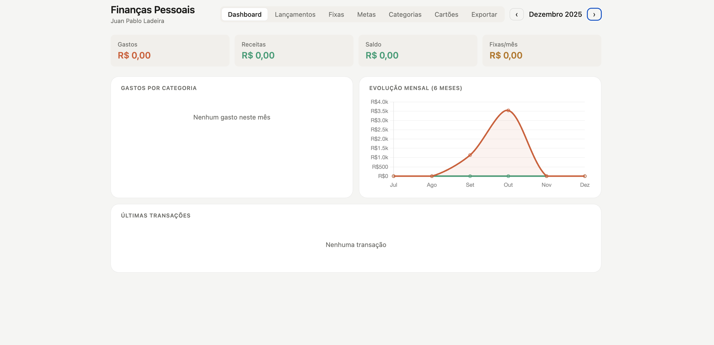

# 💰 Nome do Projeto

> Uma aplicação web para organização de finanças pessoais, com foco em clareza, controle, simplicidade e agilidade com uso da IA.

---

## 📌 Sobre o projeto

Este projeto foi desenvolvido com o objetivo de ajudar no controle financeiro pessoal, permitindo registrar receitas, despesas e acompanhar o fluxo de dinheiro de forma prática.

A ideia através deste projeto foi transformar a forma como o usuário enxerga e administra suas finanças de maneira dinâmica e rápida.

---

## 🚀 Funcionalidades

- ✅ Cadastro de receitas;
- ✅ Cadastro de despesas;
- ✅ Cadastro de cartões;
- ✅ Limitação de gastos por categoria;
- ✅ Visualização do saldo (gastos x receitas);
- ✅ Exportar PDF com fatura do cartão de crédito;
- ✅ Exportar PDF com gastos do mês e obter lançamentos automáticos por categoria.

---

## 🛠️ Tecnologias utilizadas

- HTML / CSS / JavaScript
- Node.js

---

## 📸 Preview

---

## 🎯 Melhorias futuras

- [ ] Autenticação de usuário
- [ ] Gráficos financeiros
- [ ] Exportação de dados em formato CSV
- [ ] Integração com banco

---

